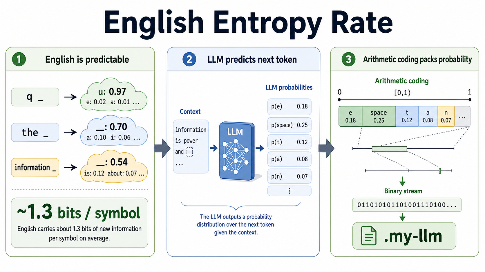

# English Entropy Rate

**Language:** English | [中文](README.zh-CN.md)

Experiments for estimating English text entropy rate with traditional
compression, language-model cross entropy, and a small LLM-driven arithmetic
compressor.



This repository grew out of a simple question:

> If English has about 26 letters, why can its entropy rate be close to
> `1.3 bit/symbol` rather than `5 bit/symbol`?

The project explores that question from three angles:

- `baseline`: compare ordinary lossless compressors against raw UTF-8 text.
- `llm`: estimate ideal arithmetic-coding length from an LLM's next-token
  probabilities.
- `compress` / `decompress`: write and read real `.my-llm` compressed files
  using LLM probabilities plus arithmetic coding.

## Current Results

On a normalized Project Gutenberg copy of *Middlemarch* containing only
lowercase English letters `a-z` and spaces:

| method/model | scope | bits/char |
| --- | --- | ---: |
| gzip | full book | 2.8062 |
| bz2 | full book | 2.0179 |
| lzma | full book | 2.2080 |
| `distilbert/distilgpt2` ideal LLM code | full book | 1.3948 |
| `distilbert/distilgpt2` ideal LLM code | first 50k chars | 1.4126 |
| `Qwen/Qwen3-0.6B-Base` ideal LLM code | first 50k chars | 1.1473 |

The LLM rows are theoretical payload lengths from
`sum_i -log2 P(token_i | previous context)`, excluding model weights, tokenizer
files, format headers, and finite-precision coding overhead.

## Quick Start

Run the traditional compression baselines:

```bash
PYTHONPATH=src python -m english_entropy_rate baseline data/sample.txt
```

Estimate the ideal LLM arithmetic-code length:

```bash
PYTHONPATH=src python -m english_entropy_rate llm \
  data/middlemarch_lowercase_letters_spaces.txt \
  --model distilbert/distilgpt2 \
  --limit-chars 50000 \
  --max-length 1024 \
  --stride 512
```

On Apple Silicon, the CLI automatically prefers the MPS backend when available.
Override it with `--device cpu` or `--device mps` when comparing hardware.

Compress a UTF-8 text file to `.my-llm`:

```bash
PYTHONPATH=src python -m english_entropy_rate compress \
  data/sample.txt \
  --model distilbert/distilgpt2
```

The default output path appends `.my-llm`, for example
`data/sample.txt.my-llm`. Decompress with the same model:

```bash
PYTHONPATH=src python -m english_entropy_rate decompress \
  data/sample.txt.my-llm \
  /tmp/sample.roundtrip.txt \
  --model distilbert/distilgpt2
```

For larger texts, start with a small prefix and a small model. The current
compressor MVP recomputes model context per token, so it is correct but slow.

## Corpus Preparation

The repository includes a Project Gutenberg copy of *Middlemarch* and a cleaned
version containing only lowercase letters and spaces:

```bash
PYTHONPATH=src python -m english_entropy_rate clean \
  data/middlemarch_gutenberg_145.txt \
  data/middlemarch_lowercase_letters_spaces.txt
```

The cleaning step lowercases letters, treats every non-`a-z` character as a word
boundary, and collapses consecutive spaces.

## Metrics

For a text file with `N` UTF-8 bytes and `C` Python characters:

```text
bits_per_byte = compressed_bits / N
bits_per_char = compressed_bits / C
```

For the LLM estimator:

```text
ideal_bits = sum_i -log2 P(token_i | previous context)
```

This is the compressed length an ideal arithmetic coder would approach if both
encoder and decoder shared exactly the same model and tokenizer.

## `.my-llm` Format

The compressor writes a fixed-size binary header followed by an arithmetic-coded
payload:

```text
8 bytes   magic/version: MYLLM001
32 bytes  sha256(model_name)
8 bytes   original UTF-8 byte length, big-endian unsigned integer
4 bytes   tokenizer token count, big-endian unsigned integer
4 bytes   first token id, big-endian unsigned integer
...       arithmetic-coded predicted tokens
```

The first token is stored directly because the current MVP scores
`P(token_i | previous tokens)`. The arithmetic payload stores tokens
`1..N-1`. The byte length and token count tell the decoder exactly when to stop;
without that metadata, arithmetic-coded intervals for different message lengths
would be ambiguous.

## Notes

- Use held-out text that the model probably has not memorized.
- Report the symbol unit clearly: byte, character, token, or letter.
- A pretrained model is shared side information. If model weights count as part
  of the compressed payload, short files become extremely expensive.
- The `.my-llm` compressor is correctness-first. A future version should add
  KV-cache decoding and batched encoder-side scoring.
